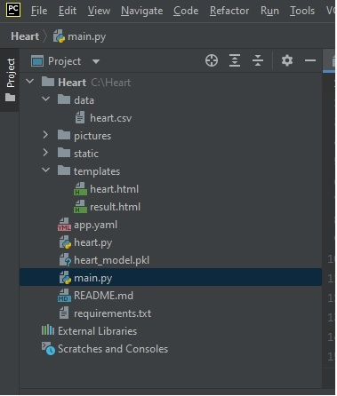
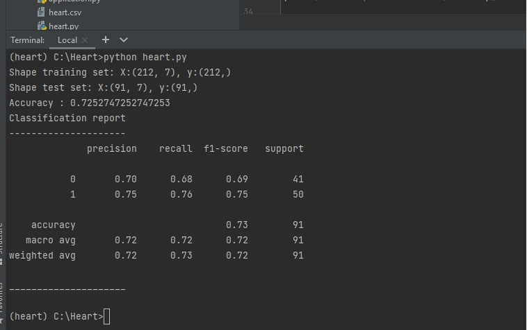
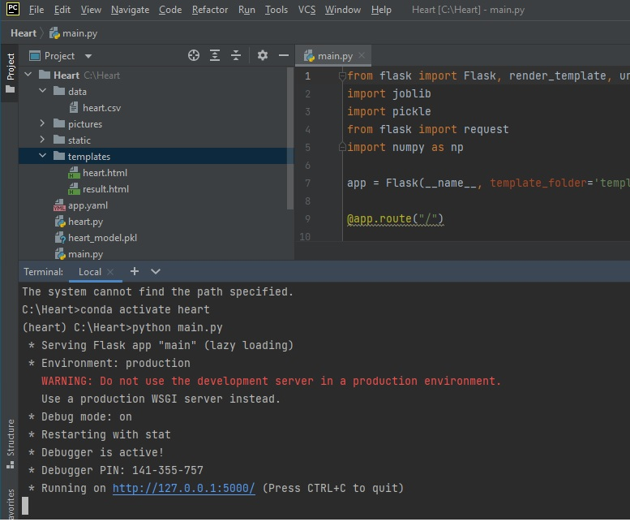
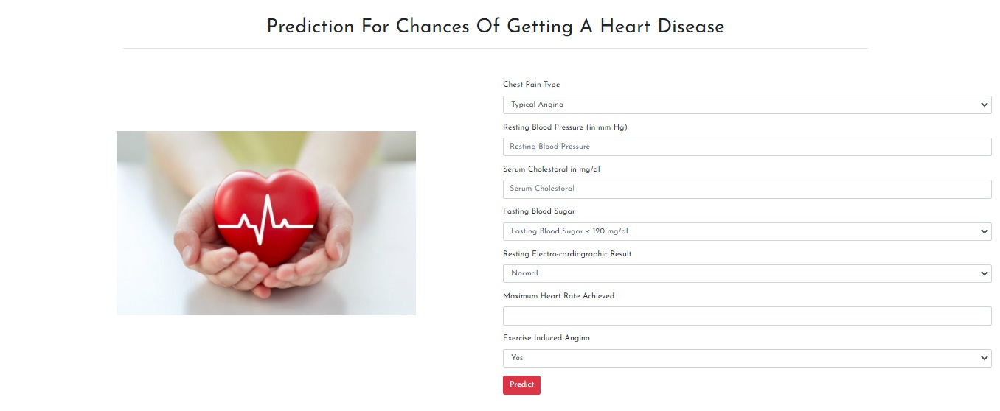

# BUILDING AN INTELLIGENT HEART DISEASE PREDICTION SYSTEM 

It can perform prediction of heart disease based on required features mentioned on web application.

  
## Installation Screenshots
- All Directories

- Created Model Result

- Web App Working on Local Host

  
## Deployment

Deployed this project to GCP

  
## Tech Stack

**Prpgramming Language:** Python

**Libraries:**

**API:** Flask

**Frontend Frameworks:** HTML,CSS

**Web Server:** GCP

**IDE:** Pycharm 

  
  
